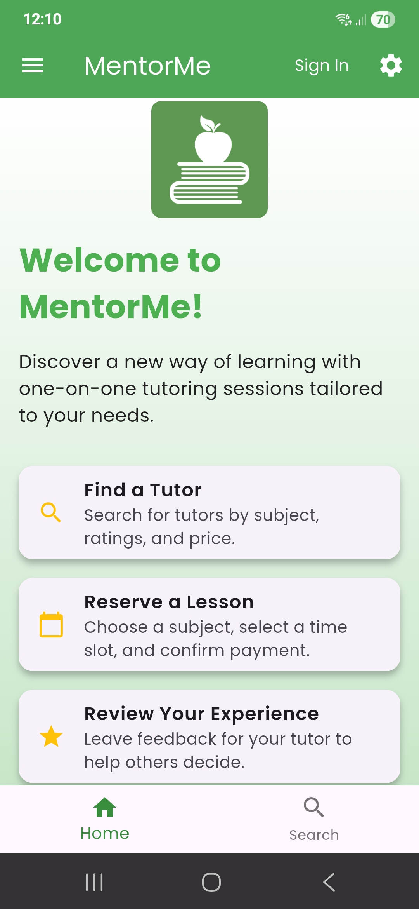
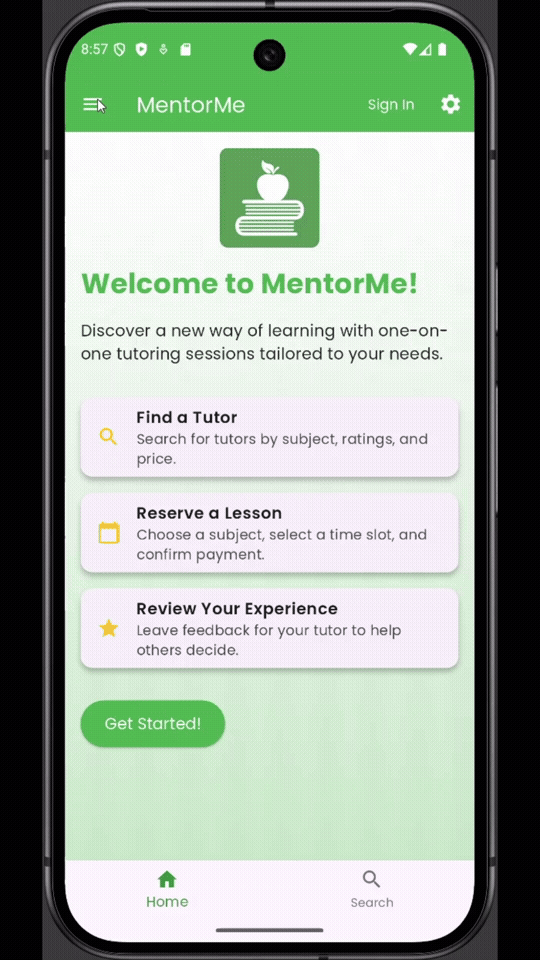
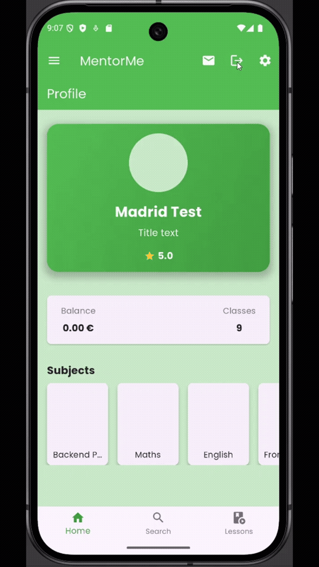
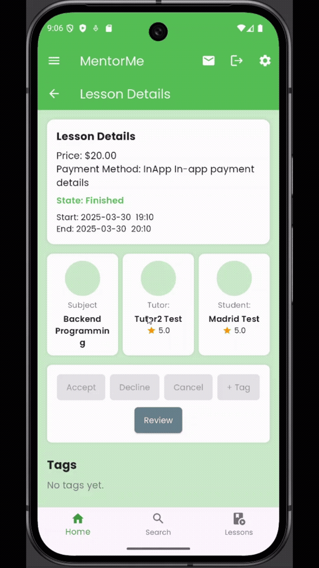

## About

A multi-application tutoring platform that connects **tutors** and **students** for 1:1 lessons, built as a modular, distributed system with a shared backend and multiple clients (Web + Mobile).

This repository contains the **Flutter Hybrid Application** that consumes the ASP.NET backend.

> **Note:** Each MentorMe repository includes its own README with app-specific setup.
>  Primary platform documentation is in the backend README, which covers the overall architecture and system design.
>  This README focuses on the mobile application's running steps and application snippets.

---

## Running the Project

### Prerequisites

1. **Install Flutter 3.28.0 or higher**
   Download: https://flutter.dev/docs/get-started/install

2. **Install Node 24 and npm**  
   Download: https://nodejs.org/en/download/package-manager

3. **Verify installations:**
   ```bash
   flutter --version
   node --version
   npm --version
   ```
   
4. **Set up an emulator or connect your physical device**. I recomment any device with Android 15.0 and API 35

### Local Setup

If you prefer running outside Docker:

1. **Navigate to the Flutter application directory:**
   ```bash
   cd ./mentor_me
   ```
   To ensure that you start with a clean solution, run the `clean` command
    ```bash
   flutter clean
   ```

2. **Install dependencies:**
   ```bash
   flutter pub get
   ```

3. **Generate localization files:**
   ```bash
   flutter gen-l10n
   ```

4. **Generate code for models:**
   The application uses `build_runner` to generate code. If you make changes to the models, you will need to run the following command to regenerate the files:
   ```bash
   flutter pub run build_runner build
   ```

5. **Run the application:**
    ```bash
   flutter run
   ```

6. **Run tokenization service:** (if you plan on using the Summarization model)
   The tokenization service is a Node.js application that uses the `@xenova/transformers` library to provide tokenization for the summarization model.
   ```bash
   cd ./tokenization_service
   npm install
   node index.js
   ```

7. Ensure that the [**MentorMe Backend**](https://github.com/MadridBabajev/MentorMe-Backend) is running locally at `http://localhost:8000`.

---

## ML Models

This project uses two TensorFlow Lite models:

*   **OCR Model (`ocr_model.tflite`):** Used for optical character recognition.
*   **Summarization Model (`summarization_model.tflite`):** Used for text summarization. This model requires the `tokenization_service` to be running.

The models are located in the `mentor_me/assets/ml_models` directory.

---

## Application Snippets

**Application's home screen from a physical device:**



**Filtering platform's tutors:**



**Switching locale:**



**User profile page and subjects:**


**Lesson reservation:**


**Lesson review:**



**Lesson cancellation:**


**Accepting lessons and adding tags:**


---

## Related

- [**MentorMe Backend**](https://github.com/MadridBabajev/MentorMe-Backend)
- [**MentorMe Frontend**](https://github.com/MadridBabajev/MentorMe-Frontend/tree/main)
- [**MentorMe TensorFlow**](https://github.com/MadridBabajev/MentorMe-TensorFlow)

---

_Madrid Babajev (10.02.2026)_
